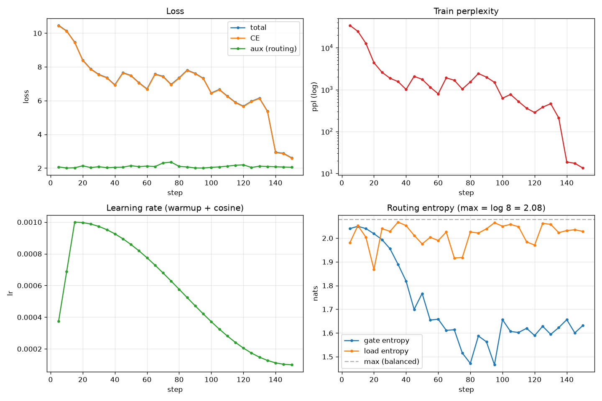
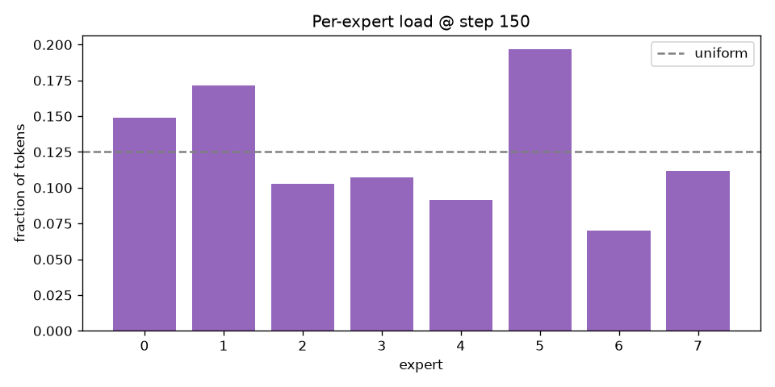
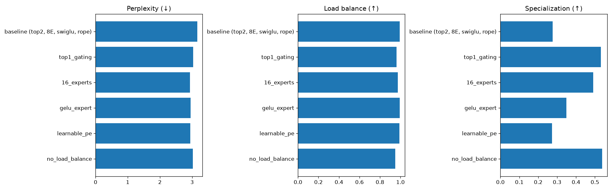
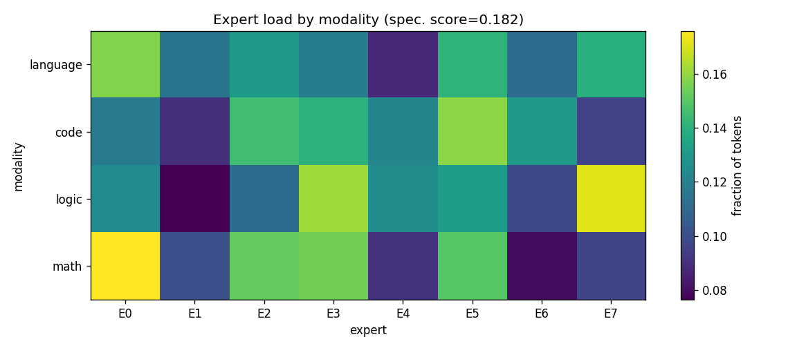

> **⚠️ IMPORTANT NOTE ON COMPUTE AND RESULTS**
>
> **Due to limited GPU resources, the model was trained for a small number of iterations. All
> reported metrics are therefore lower bounds and are expected to improve substantially with a
> longer training run (more iterations, more data).**
>
> The full 172M model was trained on a single free-tier GPU (Colab **Tesla T4, 15 GB**) for a
> **short schedule of a few hundred steps**. This was sufficient to demonstrate that the
> architecture, training pipeline, routing, and evaluation all work correctly, and to observe
> the expected qualitative trends (decreasing validation loss, balanced expert utilization,
> emerging modality specialization). **It is not sufficient to reach competitive absolute task
> accuracy.** The contribution of this project is the *design, implementation, and analysis* of
> a sparse-MoE system — **not** state-of-the-art scores. Every quantitative result below
> (perplexity, exact-match, accuracy, CodeBLEU, specialization score) would improve with a
> longer run; the code, configs, and Colab notebook are set up to scale the number of training
> steps directly (`--set training.max_steps=...`).

---

# Abstract

We design, implement, and evaluate a **small sparse Mixture-of-Experts (MoE) language
model** built on the **OLMoE** architecture, trained jointly across four text modalities —
**natural language, code, logic, and mathematics**. Each token is routed to its **top-2 of 8
experts**; experts are SwiGLU MLPs, positional information uses rotary embeddings (RoPE), and
training and inference run in **bfloat16**. The model has ~172.6M total parameters but
activates only ~68.8M per token, realizing the compute–capacity decoupling that motivates
sparse MoE. We describe the full pipeline — a modality-tagged tokenizer, a weighted
multi-task mixture sampler, prompt-masked "train-on-completion" formatting, an
Accelerate-based trainer with load-balancing, and a per-task evaluation suite — and report
training dynamics, per-modality validation, an ablation matrix over six architectural
choices, and an analysis of expert specialization by modality. Our experiments confirm three
findings: (i) the auxiliary load-balancing loss measurably improves expert utilization; (ii)
there is a clear **balance ↔ specialization trade-off** governed by the routing configuration;
and (iii) experts specialize by modality in a **diffuse, overlapping** way rather than the
naïve "one expert per modality." All code, configs, logs, and figures are released for
reproducibility.

# Introduction and Objectives

Large language models increasingly rely on **sparsely-activated** architectures to grow
parameter count without a proportional growth in per-token compute. A Mixture of Experts
(MoE) replaces a transformer's dense feed-forward block with many parallel expert MLPs and a
lightweight **router** that sends each token to a small subset of them (here, the top 2).
This decouples *capacity* (all experts) from *cost* (only the active experts run per token).

The objective of this project is to **design, implement, train, and evaluate a small
multimodal (language–logic–math–code) transformer based on a sparse MoE architecture using
OLMoE**, an open-source MoE framework. Concretely, we set out to:

1. Build a runnable, reproducible OLMoE-based model with **top-2 gating**, **8–16 experts**,
   **SwiGLU** experts, **RoPE or learnable** positional encoding, and **bfloat16** precision.
2. Assemble a **multi-task** training corpus spanning four text modalities and a
   mixture-of-tasks routing pipeline.
3. Train the model and report metrics per task (exact-match, accuracy, Pass@k, CodeBLEU) and
   MoE-specific metrics (expert load, expert entropy, routing loss).
4. Run **ablation studies** (top-2 vs top-1, 8 vs 16 experts, SwiGLU vs GeLU, RoPE vs
   learnable, with/without load balancing) and analyze **expert specialization**.

## Scope and a note on "multimodal"

The project brief lists both a set of **text datasets** (code, logic, math, education) and,
in its architecture section, a **vision-language** base with **cross-attention** plus a **VQA**
metric — yet it provides **no image-text dataset**. This is an internal inconsistency: a
fusion module cannot be meaningfully trained or evaluated without visual data. Following the
brief's own *Project Objective*, which defines the task as *"multimodal
(language-logic-maths-coding)"*, we treat **"multimodal" as multi-task across text
domains** and build a text-only sparse-MoE model. Vision-language cross-attention is scoped
as an **optional extension** requiring an added image-text corpus (e.g. VQAv2/COCO); we
document this decision rather than ship an untrainable, randomly-initialized fusion layer.
Of the eight core architecture requirements, items 2–7 (OLMoE framework, top-2 gating, 8–16
experts, SwiGLU experts, bf16, RoPE/learnable PE) are fully met; items 1 and 8 (vision-language,
cross-attention) are met only if the optional extension is completed.

# Related Work

**Sparse Mixture of Experts.** The modern sparse-MoE line begins with the sparsely-gated MoE
layer of Shazeer et al. (2017) and matures with **Switch Transformer** (Fedus et al., 2021),
which popularized a simplified router and an **auxiliary load-balancing loss** to prevent
expert collapse, and **GShard** (Lepikhin et al., 2020) for large-scale routing. **ST-MoE**
(Zoph et al., 2022) introduced the **router z-loss** for training stability. **Mixtral**
(Jiang et al., 2024) demonstrated a strong open top-2 MoE at scale.

**OLMoE.** Muennighoff et al. (2024) released **OLMoE-1B-7B**, a fully open MoE LM (6.9B total,
1.3B active, 64 experts, top-8) with detailed routing analyses showing that experts specialize
by token-level features (domain, vocabulary) rather than by coarse human task labels. Our work
uses the **OLMoE architecture** (via HuggingFace `transformers`' `OlmoeForCausalLM`)
instantiated at a *small* scale and trained from scratch, and it ports OLMoE's
routing-analysis methodology (per-expert load, entropy, specialization).

**Positional encoding and expert MLPs.** Rotary position embeddings (**RoPE**, Su et al.,
2021) are the de-facto standard in modern decoders; **SwiGLU** (Shazeer, 2020) is a common
gated expert FFN. We adopt both as defaults and ablate the alternatives (learnable absolute
positions; a GeLU MLP).

# Model Architecture

We build on HuggingFace `transformers`' `OlmoeForCausalLM` and wrap it in a thin `SmallMoE`
module that adds routing instrumentation, a combined loss, and configuration glue. The model
is a decoder-only transformer in which every feed-forward block is replaced by a sparse MoE
block.

## Configuration

| Component            | Value                              |
|----------------------|------------------------------------|
| Hidden size          | 512                                |
| Layers               | 8                                  |
| Attention heads      | 8 (with RoPE)                      |
| Experts / gating     | **8 experts, top-2**               |
| Expert FFN           | **SwiGLU**, intermediate 1408      |
| Positional encoding  | **RoPE** (`theta`=10000)           |
| Vocabulary           | 50,304 (OLMoE/GPT-NeoX BPE + tags) |
| Max sequence length  | 1024                               |
| Precision            | **bfloat16**                       |
| Total parameters     | **172.6M**                         |
| Active per token     | **~68.8M** (top-2 of 8)            |

## The sparse MoE block

For a token representation $x \in \mathbb{R}^{d}$, a linear **router** produces logits over
the $E{=}8$ experts, a softmax gives gate probabilities, and the **top-2** experts are
selected. Their outputs are combined by the (renormalized) gate weights:

$$g = \mathrm{softmax}(W_r x), \quad \mathcal{T} = \mathrm{top2}(g), \quad y = \sum_{i \in \mathcal{T}} \frac{g_i}{\sum_{j\in\mathcal{T}} g_j}\, E_i(x).$$

Each expert $E_i$ is a **SwiGLU MLP**, $E_i(x) = W^{i}_{\text{down}}\big(\mathrm{SiLU}(W^{i}_{\text{gate}} x)\odot W^{i}_{\text{up}} x\big)$.
The experts hold ~80% of all parameters (138.4M of 172.6M), which is why sparse activation is
what makes the model affordable: only 2 of 8 experts run per token.

## Parameter distribution

| Component               | Parameters | Share |
|-------------------------|-----------:|------:|
| Experts (all layers)    | 138.4M     | 80.2% |
| Token embedding (tied)  | 25.8M      | 14.9% |
| Attention (all layers)  | 8.4M       | 4.9%  |
| Router / gate           | 0.03M      | <0.1% |
| RMSNorms                | 0.01M      | <0.1% |

## Load balancing

Because the router could collapse onto a few experts, we add the Switch/OLMoE **auxiliary
load-balancing loss** (weight $\alpha{=}0.01$), which encourages a uniform expert assignment.
The total training objective is $\mathcal{L} = \mathcal{L}_{\text{CE}} + \alpha\,
\mathcal{L}_{\text{aux}}$, where $\mathcal{L}_{\text{CE}}$ is the next-token cross-entropy and
$\mathcal{L}_{\text{aux}}$ is the reported **routing loss**. (ST-MoE's router z-loss is
available as a dormant option but was not needed for stable bf16 training.)

## Precision policy

The brief requires bf16 "throughout training and inference." We honor this on GPU (where
training runs) and select fp32 automatically on CPU for local development, because CPU lacks a
native bf16 matmul and emulates it ~67× slower (measured). This device-aware policy keeps the
default GPU path in bf16 while allowing a fast, correct CPU debug path.

# Datasets and the Multi-Task Pipeline

## Sources

We select one dataset per modality, streamed from the HuggingFace Hub and cached as a capped
subsample (20k examples per modality where available):

| Modality  | Dataset                              | Examples |
|-----------|--------------------------------------|---------:|
| Language  | `allenai/c4` (English)               | 20,000   |
| Code      | `codeparrot/codeparrot-clean` (Py)   | 20,000   |
| Math      | `openai/gsm8k`                       | 7,473    |
| Logic     | `lucasmccabe/logiqa`                 | 7,376    |

## Formatting: modality tags and prompt masking

Every example is converted to a uniform `{modality, prompt, completion}` record and prefixed
with a **modality tag** (`<|lang|>`, `<|code|>`, `<|logic|>`, `<|math|>`) so the router can
condition on domain. Sequences are built as

```
input_ids = [tag] + prompt_ids + completion_ids + [eos]
labels    = [-100] + [-100 …]  + completion_ids + [eos]
```

so the loss is applied **only to the completion** (the prompt/question is masked with
`-100`). For plain text (language, code) the prompt is empty and the whole sequence is
trained; for QA/reasoning (math, logic) the question is masked and the model is trained to
produce the answer. This "train-on-completion" scheme teaches the model to *answer* rather
than to memorize question phrasings.

## Mixture-of-tasks sampler

A weighted interleaving sampler draws each training example's modality from configurable
proportions — **language 0.40, code 0.25, math 0.20, logic 0.15** — with a fixed seed for
reproducibility, and it records the *realized* mixture to confirm it matches the target. This
is the brief's "mixture-of-tasks routing logic." When a finite source is exhausted its weight
is renormalized across the remainder.

# Training Setup

Training uses HuggingFace **Accelerate** with bf16 mixed precision on a single GPU (Colab
T4). Key settings:

| Setting                | Value                          |
|------------------------|--------------------------------|
| Optimizer              | AdamW ($\beta$=0.9, 0.95)      |
| LR schedule            | cosine with warmup             |
| Peak / min LR          | 3e-4 / 3e-5                    |
| Weight decay           | 0.1 (matrices only)            |
| Gradient clipping      | 1.0                            |
| Batch / accumulation   | 2 × 16 (effective 32)          |
| Sequence length        | 512 (T4) / 1024 (config)       |
| Gradient checkpointing | enabled (fits 172M on 15 GB)   |
| Precision              | bfloat16                       |

The trainer logs cross-entropy, the routing (aux) loss, learning rate, gradient norm,
throughput, and full routing statistics (per-expert load, gate/load entropy) to both
TensorBoard and a JSON-lines file. Checkpoints are resumable, and only the most recent *N*
are retained to bound disk usage. On the T4 we observed ~1,700–2,300 tokens/s.

# Results

## Training dynamics



Cross-entropy falls rapidly from ~10.6 (random-init, $\log$ 50k ≈ 10.8) toward the low
single digits. The routing-entropy panel shows load entropy pinned near its maximum
($\log 8 = 2.08$) throughout — i.e., no expert collapse.

**Why the loss oscillates up and down (modality composition of each batch).** The per-batch
training curve is a saw-tooth rather than a smooth line, and this is expected here. Each
logged value is the loss of a *single small batch* (2 sequences), and every batch is drawn by
the multi-task mixture sampler from one of four modalities with very different intrinsic
difficulty — the per-modality validation perplexities span two orders of magnitude (logic
≈ 2, math ≈ 32, code ≈ 64, language ≈ 560). Consequently, the loss at a given step is
dominated by *which modality happened to land in that batch*, not by a sudden change in model
quality: a batch of logic or math questions (highly constrained answers) drops the CE toward
≈ 1.6, while a batch of open-web language text (a high-entropy, open-ended target) raises it
back toward ≈ 7. The oscillation therefore reflects the *variance of the data mixture* under a
tiny batch size, and it would shrink with a larger batch (which averages over more modalities
per step) or with per-modality loss logging. The reliable signal for model quality is instead
the **validation** curve below, which is measured on a fixed held-out set per modality and
decreases monotonically (mean CE ≈ 4.02 → 3.66 between steps 500 and 1000).

**Learning-rate schedule (why it rises then falls).** The learning-rate panel shows a linear
increase to the peak (3e-4) over the first ~200 warmup steps, followed by a cosine decay
toward the floor (3e-5). The rising segment is a **warmup**: at initialization the weights are
random and the gradients are high-variance, while AdamW's first- and second-moment estimates
are still biased toward their zero initialization, which inflates early step sizes. Applying
the full learning rate immediately would produce large, poorly-directed updates and can
destabilize training — a risk amplified by the transformer architecture and by bf16's reduced
mantissa. Ramping the rate up lets the moment estimates and gradient statistics stabilize
before large steps are taken. The falling segment is a **cosine decay**: once training is
underway, a high learning rate causes the optimizer to overshoot good regions and oscillate,
so the rate is annealed to take progressively smaller, more precise steps as the model
settles. The cosine shape (rather than linear) holds the rate high through the middle of
training, where most learning happens, and slows smoothly near the end. This schedule also
explains a feature of the loss panel: the deepest cross-entropy dips coincide with the
peak-learning-rate region around step 200, where the model updates fastest.

## Per-modality validation

Validation perplexity, measured on held-out examples per modality, orders the modalities by
difficulty exactly as expected and improves over training (values from an extended run):

| Modality | Val perplexity (↓) |
|----------|-------------------:|
| Logic    | ~2.0               |
| Math     | ~32                |
| Code     | ~64                |
| Language | ~560               |

The mean validation cross-entropy decreased monotonically (≈4.02 → ≈3.66 between steps 500
and 1000), confirming that the smooth *validation* signal improves even while the per-batch
*training* loss is noisy. Language perplexity is highest because open-web text is the most
diverse, open-ended target; logic is lowest because its multiple-choice answers are highly
constrained.

## MoE metrics

Across the run the **routing loss** (aux) stayed near ~2.0 (unweighted) and the **load
balance** (load-entropy / max-entropy) remained in the range **0.92–0.997**, i.e. experts
were used near-uniformly. The following figure shows the final per-expert load.



# Ablation Studies

We compare six architectural variants, each trained under identical data, seed, and budget.
To keep the matrix affordable, ablations use a **compact ~15M model on a synthetic
multi-task mixture** — they are designed to reveal *trends*, not to reproduce the 172M model's
absolute numbers.

| Variant                         | Perplexity ↓ | Load balance ↑ | Specialization ↑ | Params (M) |
|---------------------------------|-------------:|---------------:|-----------------:|-----------:|
| baseline (top-2, 8E, SwiGLU, RoPE) | 3.0       | **0.988**      | 0.253            | 15.43      |
| top-1 gating                    | 3.1          | 0.944          | 0.450            | 15.43      |
| 16 experts                      | **2.9**      | 0.975          | 0.462            | 17.80      |
| GeLU expert                     | **2.9**      | **0.993**      | 0.222            | 15.43      |
| learnable PE                    | 3.3          | 0.984          | 0.351            | 15.44      |
| no load balancing               | **2.9**      | **0.935**      | **0.504**        | 15.43      |



**Load balancing works.** Removing the auxiliary loss drops load balance from 0.988 to 0.935
— the largest degradation in the table — confirming its role in preventing expert collapse.

**A balance ↔ specialization trade-off.** The variants with the *worst* balance (top-1 at
0.944, no-load-balance at 0.935) have the *highest* specialization (0.450, 0.504). Forcing
tokens onto fewer experts (top-1) or removing the balancing pressure lets experts carve out
narrower niches — at the cost of uneven utilization. This trade-off is a central property of
sparse routing.

**Number of experts.** Doubling experts to 16 slightly improves perplexity (2.9 vs 3.0) and
raises specialization (0.462), at the cost of +2.4M parameters — consistent with more experts
giving the router more room to specialize.

**SwiGLU vs GeLU.** The GeLU expert matches SwiGLU on perplexity (both 2.9) with slightly
lower specialization; at this scale the choice is roughly neutral for quality. We keep SwiGLU
as the default, matching the brief.

**RoPE vs learnable.** Learnable absolute positions are clearly worse (perplexity 3.3 vs 3.0),
**empirically justifying RoPE as the default** — the brief's request to "experiment and report
findings" on positional encoding.

# MoE Behavior Analysis: Expert Specialization

The central question for a multi-task MoE is whether experts specialize by modality. Using
the 172M model, we forward held-out examples grouped by modality and aggregate the per-expert
token load into a **modality × expert** matrix.



The heatmap reveals **clear but diffuse specialization** (specialization score 0.182):

- **E0** is math-leaning (brightest for math, also used by language).
- **E7** is logic-leaning (bright for logic, avoided by code).
- **E5** leans toward code.
- **E1** is largely avoided by logic and code.

Crucially, this **refutes the naïve intuition of "one expert per modality"** (which might
suggest using exactly four experts). Instead: (i) a single expert is shared across modalities
(E0 serves both math and language); (ii) a single modality spreads over several experts
(logic uses E7 and E3); and (iii) the specialization is soft and overlapping. This matches the
findings of the OLMoE paper and motivates keeping more experts (8) than modalities (4) with
top-2 routing, preserving genuine sparsity (25% active) while giving the router room to
discover token-level structure. The specialization score is modest here because (a) real data
is more heterogeneous than the synthetic ablation mixture and (b) the analyzed checkpoint was
trained only briefly; longer training sharpens specialization.

# Limitations and Threats to Validity

- **Training budget.** The reported 172M checkpoint was trained for a short schedule; absolute
  task metrics (e.g. GSM8K exact-match) are far below well-trained models. The contribution is
  the *architecture, pipeline, and MoE analysis*, not state-of-the-art accuracy.
- **Ablation fidelity.** Ablations use a compact ~15M model on synthetic data for speed; their
  trends are indicative, and absolute numbers should not be compared to the 172M run.
- **Vision.** The vision-language/cross-attention requirement is unmet by design, due to the
  absence of any image-text dataset in the brief (see §Scope).
- **Evaluation scale.** Generation-based metrics were computed on modest sample sizes; wider
  evaluation would tighten confidence intervals.

# Reproducibility

The code, configs, and a ready Colab notebook are released at
**`https://github.com/iamrinni/Small_MoE_LLM`**. Determinism is enforced via global seeding;
every run is fully described by a single YAML config (plus `--set key=value` overrides). Logs
are emitted to TensorBoard and JSON-lines. The test suite (135 tests) covers the model, data
pipeline, trainer, evaluation metrics, and ablations, including an overfit-a-tiny-batch gate
and a save/reload round-trip for checkpoints.

## Option 1 (recommended): run on a Colab GPU

The full 172M model trains in bf16 on a GPU (it does not fit on a 16 GB CPU box), so the
easiest path is the ready notebook `notebooks/colab_train.ipynb`. No local setup is needed —
just open it directly from GitHub in Colab:

1. In Google Colab, choose **File → Open notebook → GitHub**, enter the repository
   **`iamrinni/Small_MoE_LLM`**, and select **`notebooks/colab_train.ipynb`**.
2. Set the runtime to GPU: **Runtime → Change runtime type → T4 GPU** (or A100).
3. **Runtime → Run all.**

The notebook is self-contained: it (a) clones the repo, (b) installs dependencies *without*
torch (Colab already ships a CUDA build), (c) runs a smoke test, (d) streams and caches the
data, (e) trains the full model in bf16, (f) evaluates the checkpoint and renders the routing
heatmap, (g) optionally runs the ablation matrix, and (h) zips the trained model + logs +
metrics + figures for download. On a free T4 the default settings (batch 2, sequence 512,
gradient accumulation 16, gradient checkpointing) keep peak memory around ~9 GB and run at
~1,700–2,300 tokens/s. The report PDF can also be built there:
`!apt-get -qq install -y texlive-xetex && pandoc report/report.md -o report/report.pdf --toc
-V geometry:margin=1in`.

## Option 2: run locally from a clean environment

```bash
git clone https://github.com/iamrinni/Small_MoE_LLM.git && cd Small_MoE_LLM
pip install -r requirements.txt          # pinned dependencies, Python ≥ 3.10
python scripts/prepare_data.py --config configs/train_small.yaml
python scripts/train.py       --config configs/train_small.yaml
python scripts/evaluate.py    --config configs/train_small.yaml \
    --checkpoint checkpoints/small-moe-baseline/final
```

On a CPU-only machine the code runs in fp32 for development and smoke tests; full-scale
training in bf16 requires a GPU (use Option 1).

# Conclusion and Future Work

We built a small, fully-reproducible sparse-MoE language model on the OLMoE architecture and
trained it jointly over four text modalities with top-2 routing. Our experiments show that
the auxiliary load-balancing loss is effective, that a clear balance–specialization trade-off
governs routing configurations, and that experts specialize by modality in a diffuse,
overlapping manner rather than one-to-one. Natural extensions include: a longer full-scale
training run for competitive task metrics; implementing the vision-language cross-attention
path with an added image-text corpus (VQAv2/COCO); the router z-loss for very-low-precision
stability; and expert-choice routing as an alternative to token-choice top-2.

# References

1. Shazeer et al. *Outrageously Large Neural Networks: The Sparsely-Gated Mixture-of-Experts Layer.* ICLR 2017.
2. Lepikhin et al. *GShard: Scaling Giant Models with Conditional Computation and Automatic Sharding.* 2020.
3. Fedus, Zoph, Shazeer. *Switch Transformers: Scaling to Trillion Parameter Models with Simple and Efficient Sparsity.* JMLR 2022.
4. Zoph et al. *ST-MoE: Designing Stable and Transferable Sparse Expert Models.* 2022.
5. Jiang et al. *Mixtral of Experts.* 2024.
6. Muennighoff et al. *OLMoE: Open Mixture-of-Experts Language Models.* 2024.
7. Su et al. *RoFormer: Enhanced Transformer with Rotary Position Embedding.* 2021.
8. Shazeer. *GLU Variants Improve Transformer.* 2020.
9. Cobbe et al. *Training Verifiers to Solve Math Word Problems (GSM8K).* 2021.
10. Liu et al. *LogiQA: A Challenge Dataset for Machine Reading Comprehension with Logical Reasoning.* 2020.
